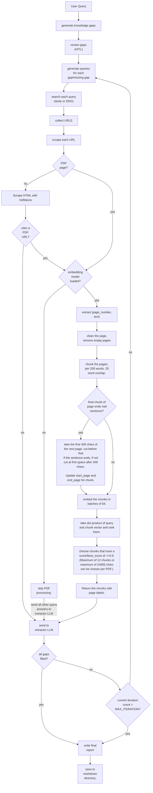

## Complete Architecture

```mermaid
---
config:
  layout: fixed
---
flowchart TB
    user["User Query"] --> gaps["generate knowledge gaps"]
    gaps --> review["review gaps<br>(HITL)"]
    review --> queries["generate queries<br>for each<br>gap/missing gap"]
    queries --> search["search each query<br>(tavily or DDG)"]
    search --> hits["collect URLS"]
    hits --> scrape["scrape each URL"]
    scrape --> pdf{"PDF<br>page?"}
    pdf -- no --> traf["Scrape HTML with trafilatura"]
    traf --> cites{"cites a<br>PDF<br>URL?"}
    cites -- no --> extractor["send to<br>extractor LLM"]
    cites -- yes --> model{"embedding<br>model<br>loaded?"}
    pdf -- yes --> model
    model -- yes --> extract["extract (page_number,<br>text)"]
    model -- no --> skip["skip PDF<br>processing."]
    skip -- send all other query<br>answers to<br>extractor LLM --> extractor
    extract --> clean["clean the page,<br>remove empty pages"]
    clean --> chunk["chunk the pages,<br>per 200 words, 20<br>word overlap."]
    chunk --> mid{"final chunk of<br>page ends mid<br>sentence?"}
    mid -- yes --> spill["take the first 400 chars of<br>the next page, cut before that<br>if the sentence ends, if not<br>cut at first space after 400<br>chars.<br><br>Update start_page and<br>end_page for chunk."]
    spill --> embed["embed the chunks in<br>batches of 64."]
    embed --> rank["take dot product of query<br>and chunk vector and rank<br>them."]
    rank --> choose["choose chunks that have a<br>score/best_score of &gt;=0.6.<br>(Maximum of 12 chunks or<br>maximum of 24000 chars<br>can be chosen per PDF.)"]
    choose --> back["Return the chunks with<br>page labels."]
    back --> extractor
    extractor --> filled{"all gaps<br>filled?"}
    filled -- no --> iter{"current iteration<br>count &gt;<br>MAX_ITERATION?"}
    filled -- yes --> report["write final<br>report"]
    iter -- yes --> report
    iter -- no --> queries
    report --> save["save to<br>markdown<br>directory."]
    mid -- no --> embed
```