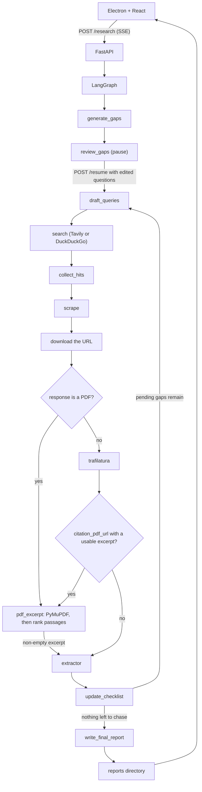

# Deep Research

A desktop app that turns one question into a sourced Markdown report. You ask a topic in an Electron window. A LangGraph pipeline on a local FastAPI server breaks the topic into questions, lets you edit them, searches the web, reads HTML and PDFs, and writes the report. Finished reports stay on disk and show up in the sidebar.

## Install

Download a build from the [releases](https://github.com/anonthedev/deep-research/releases) page. `<version>` below is the release number without the leading `v`, so tag `v0.0.3` uses `0.0.3` in the filename. After the app opens, enter an OpenRouter API key. It stays on this computer.

### macOS

1. Download `Athel-<version>.dmg`.
2. Move the file to `/Applications`.
3. The build is not notarized, so macOS may refuse to open it. Clear the quarantine flag:

```bash
xattr -cr /Applications/Athel-<version>.dmg
```

4. Open the disk image and drag Athel into the Applications folder.
5. Open Athel from Applications.

### Windows

1. Download `Athel-<version>-setup.exe`.
2. Run the installer.
3. Open Athel from the desktop shortcut or the Start menu.

### Linux

AppImage:

```bash
chmod +x Athel-<version>.AppImage
./Athel-<version>.AppImage
```

Debian and Ubuntu:

```bash
sudo apt install ./athel_<version>_amd64.deb
```

## How it works

The Electron main process starts the Python backend if `http://127.0.0.1:8000/health` is not already up, then opens the React window. Submitting a topic posts to `POST /research`. The server runs the graph in a background thread and streams progress as server-sent events. After the questions are drafted, the graph pauses. You edit them in the window, and `POST /research/{thread_id}/resume` continues the run. When the writer finishes, the report is saved and the window switches from the live trace to the rendered Markdown. Aborting posts to `POST /research/{thread_id}/abort` and the stream ends with `aborted`.



The diagram below is the path through the app. [Architecture](ARCHITECTURE.md) is the full pipeline, including how a PDF is split, ranked, and sent to the extractor. If you prefer excalidraw then [Architecture PNG](Architecture.png) or [Excalidraw File](Architecture.excalidraw)

Each pass fans out. Pending gaps are drafted in parallel, each query is searched in parallel, and each new URL is scraped in parallel. `collect_hits` and `update_checklist` are deferred nodes: they wait until every branch of that wave has finished before the graph continues.

A download whose bytes are a PDF goes through `pdf_excerpt` in `backend/app/helper/pdf.py`. PyMuPDF reads the pages, the text is split into overlapping passages, and the run’s embedding model ranks those passages against the gap question. The highest-scoring passages, up to twelve and within a character budget, are what the extractor sees, each marked with its page. An empty excerpt is dropped and the extractor is not called. An HTML page that publishes a `citation_pdf_url` is followed to that PDF when the download returns a non-empty excerpt. Otherwise the HTML text is kept.

A gap is **resolved** when notes cover the question. It stays **pending** and is searched again, this time only for the missing parts, until it has been tried `max_iterations` times. That limit is 1–10 and defaults to 3. After that, a gap with notes is **partial** and a gap with none is **failed**. The writer states what a partial gap established and what is still missing, and says briefly that a failed gap was not established. Hosts that fail to download are added to a blocked-domain list and skipped on later loops. Search defaults to DuckDuckGo. Tavily is used only when that engine is selected and a Tavily API key is set.

## Models

Each run uses an OpenRouter key and four models you choose in the window. The catalog comes from [OpenRouter](https://openrouter.ai/). The key stays in the browser’s local storage on this computer and is sent only to the local server, which uses it for that run and does not write it to disk. A Tavily key, when you add one, is stored the same way and is required only when the search engine is Tavily.

Planner and extractor choices are limited to models that accept tool calls, because those steps return structured data. The writer can be any text model. The embedding model is chosen from OpenRouter’s embedding catalog and is used only to rank passages inside a PDF.

| Role | Default | Job |
| --- | --- | --- |
| Planner | `openai/gpt-5-mini` | Split the topic into 5–7 questions, write search queries, and list what a gap still lacks |
| Extractor | `google/gemini-3.1-flash-lite` | Read a scraped page and keep only the facts that answer the question, or useful side notes |
| Writer | `anthropic/claude-sonnet-5` | Turn the evidence dossier into one Markdown report with inline source links |
| Embedding | `openai/text-embedding-3-small` | Rank PDF passages against the gap question so the extractor sees the relevant pages |

The writer is instructed to use only facts from the dossier, keep specific names, dates, and numbers, and cite the URL attached to the note the sentence came from.

## Repository layout

```
deep-research/
├── backend/
│   ├── main.py                 # FastAPI app, SSE stream, report files
│   ├── app/
│   │   ├── graph.py            # LangGraph wiring
│   │   ├── states.py           # Shared state and models
│   │   ├── llm.py              # OpenRouter clients
│   │   ├── helper/
│   │   │   └── pdf.py          # PDF text, passage ranking
│   │   └── nodes/
│   │       ├── planning.py     # gaps, review, queries, checklist
│   │       ├── search.py       # search, HTML scrape, PDF hop
│   │       └── report.py       # final Markdown
│   ├── reports/                # saved reports (gitignored)
│   └── pyproject.toml
└── frontend/
    └── src/
        ├── main/               # Electron: window + backend process
        ├── preload/
        └── renderer/           # React UI
```

## Requirements

- Python 3.13
- [uv](https://docs.astral.sh/uv/)
- Node.js with [pnpm](https://pnpm.io/)
- An [OpenRouter](https://openrouter.ai/keys) API key, entered in the app

## Setup

From the repo root:

```bash
cd backend
uv sync

cd ../frontend
pnpm install
pnpm dev
```

`pnpm dev` starts Electron. On launch the main process spawns `backend/.venv/bin/python -m uvicorn main:app --host 127.0.0.1 --port 8000 --reload` when that port is not already healthy, and kills that process when the app quits. A packaged build starts the bundled `server` binary instead.

To run the API on its own:

```bash
cd backend
uv run uvicorn main:app --host 127.0.0.1 --port 8000 --reload
```

The desktop UI talks to `http://127.0.0.1:8000`. CORS allows the Vite dev origin `http://localhost:5173`.

Packaged builds:

```bash
cd frontend
pnpm build:linux   # or build:win / build:mac
```

## Using the app

1. Enter an OpenRouter API key. Pick a planner, extractor, writer, and embedding model. Choose DuckDuckGo or Tavily, and how many times a gap may be searched. Tavily asks for its own key when none is saved. Type a question or pick a suggestion. Submit with the button or Ctrl/⌘+Enter.
2. The planner drafts the questions and the run pauses. Edit, add, or remove them, then choose **Start research**. At least one question is required. **Abort** returns to the question form.
3. The sidebar lists the run under **Ongoing research**. The main pane shows questions, search hits, findings, dead URLs, and gap status as they arrive. **Abort** is available on that trace as well.
4. When the stream finishes, the Markdown report opens and the run is filed under **Reports**. The folder button beside that heading opens the reports directory.
5. Earlier reports load from disk. On startup the most recently updated report opens automatically.

Report filenames use the first 40 characters of the topic slug. In development that file is `backend/reports/<slug>.md`. A packaged build writes to the app user-data `reports` directory, set with `DEEP_RESEARCH_REPORTS`. Asking the same topic again overwrites that file.

## HTTP API

| Method | Path | Response |
| --- | --- | --- |
| `GET` | `/health` | `{ "status": "ok" }` |
| `GET` | `/models` | OpenRouter catalog: `{ id, name, tools }`. `tools` is true when the model can fill the planner or extractor role |
| `POST` | `/openrouter/key` | Checks a key. Body: `{ "api_key": "..." }`. `{ "ok": true }`, or 401 if OpenRouter rejects it |
| `POST` | `/embedding-models` | OpenRouter embedding catalog. Body: `{ "api_key": "..." }` |
| `POST` | `/research` | SSE stream. Body: `{ "topic", "thread_id", "api_key", "planner_model", "extractor_model", "writer_model", "embedding_model", "max_iterations", "search_engine", "tavily_api_key" }`. `max_iterations` is 1–10 and defaults to 3. `search_engine` is `duckduckgo` (the default) or `tavily`. `tavily_api_key` is required when the engine is Tavily |
| `POST` | `/research/{thread_id}/resume` | SSE stream that continues a paused run. Body: `{ "questions", "api_key", "planner_model", "extractor_model", "writer_model", "embedding_model", "tavily_api_key" }`. `questions` is 1–7 non-empty strings. 404 if that thread is not paused |
| `POST` | `/research/{thread_id}/abort` | Stops that run. `{ "ok": true }` |
| `GET` | `/reports` | JSON list of `{ slug, title, updated_at }`, newest first |
| `GET` | `/reports/{slug}` | Raw Markdown |

SSE payloads are `data: {json}\n\n` lines. A comment ping (`: ping`) is sent if a graph step is quiet for 15 seconds.

| `type` | When | Fields |
| --- | --- | --- |
| `gaps` | Questions are drafted | `questions` |
| `review` | The graph pauses so you can edit the questions | `thread_id`, `questions`, optional `error` |
| `search` | A query returns URLs | `gap_id`, `urls` |
| `finding` | A page yields a note | `gap_id`, `source`, `answers`, `note` |
| `dead_url` | A download fails | `url` |
| `gap` | Checklist updates | `id`, `question`, `status`, `missing` |
| `report` | The writer finishes | `markdown` |
| `done` | The graph finished. A review pause sends `review` instead | |
| `aborted` | The run was aborted | |
| `error` | The graph raised | `message` |

`status` on a gap is `pending`, `resolved`, `partial`, or `failed`.

## Graph state

`OverallState` in `backend/app/states.py` is the shared blackboard:

- `topic` — the question from the UI
- `gaps` — checklist items (`id`, `question`, `status`, `notes`, `missing`, `attempts`)
- `hits` — search URLs, appended across branches
- `findings` — extracted notes, appended across scrapes
- `additional_info` — useful facts that did not answer their question
- `dead_urls` and `blocked_domains` — failed fetches, appended across scrapes
- `final_report` — the Markdown the writer returned
- `max_iterations` — how many times a pending gap may be searched
- `search_engine` — `duckduckgo` or `tavily`
- `research_loops` — set to 0 when the run starts and left unchanged

`hits`, `findings`, `dead_urls`, and `blocked_domains` use a list reducer so parallel branches accumulate instead of overwriting each other.

## License

MIT. See [LICENSE](LICENSE).
