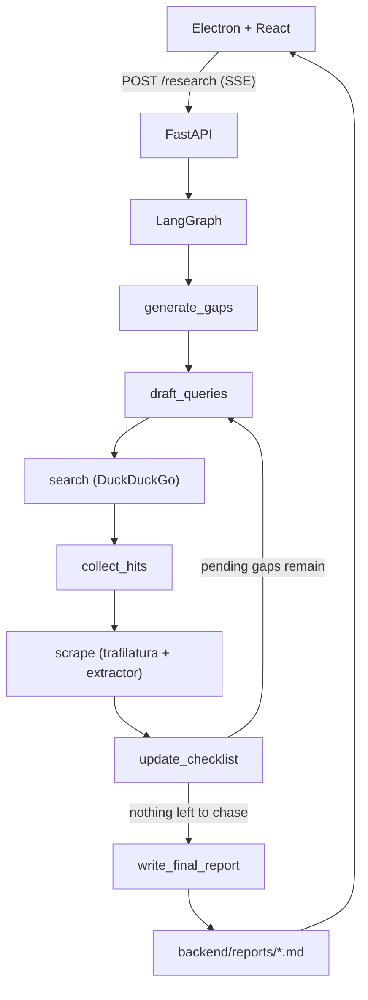

# Deep Research

A desktop app that turns one question into a sourced Markdown report. You ask a topic in an Electron window. A LangGraph pipeline on a local FastAPI server breaks the topic into questions, searches the web, reads pages, and writes the report. Finished reports stay on disk and show up in the sidebar.

## How it works

The Electron main process starts the Python backend if `http://127.0.0.1:8000/health` is not already up, then opens the React window. Submitting a topic posts to `POST /research`. The server runs the graph in a background thread and streams progress as server-sent events. When the writer finishes, the report is saved under `backend/reports/` and the window switches from the live trace to the rendered Markdown.



Each pass fans out. Pending gaps are drafted in parallel, each query is searched in parallel, and each new URL is scraped in parallel. `collect_hits` and `update_checklist` are deferred nodes: they wait until every branch of that wave has finished before the graph continues.

A gap is **resolved** when notes cover the question. It stays **pending** and is searched again, this time only for the missing parts, until it has been tried three times. After that it is marked **failed**, and the writer says briefly that the research did not establish it. Hosts that fail to download are added to a blocked-domain list and skipped on later loops.

## Models

All three calls go through [OpenRouter](https://openrouter.ai/) (`OPENROUTER_API_KEY`):

| Role | Model | Job |
| --- | --- | --- |
| Planner | `openai/gpt-5-mini` | Split the topic into 5–7 questions, write search queries, and list what a gap still lacks |
| Extractor | `google/gemini-3.1-flash-lite` | Read a scraped page and keep only the facts that answer the question, or useful side notes |
| Writer | `anthropic/claude-sonnet-5` | Turn the evidence dossier into one Markdown report with inline source links |

The writer is instructed to use only facts from the dossier, keep specific names, dates, and numbers, and cite the URL attached to the note the sentence came from.

## Repository layout

```
deep-research/
├── backend/
│   ├── main.py                 # FastAPI app, SSE stream, report files
│   ├── app/
│   │   ├── graph.py            # LangGraph wiring
│   │   ├── states.py           # Shared state and models
│   │   ├── llm.py              # OpenRouter clients
│   │   └── nodes/
│   │       ├── planning.py     # gaps, queries, checklist
│   │       ├── search.py       # DuckDuckGo search and page scrape
│   │       └── report.py       # final Markdown
│   ├── reports/                # saved reports (gitignored)
│   └── pyproject.toml
└── frontend/
    └── src/
        ├── main/               # Electron: window + backend process
        ├── preload/
        └── renderer/           # React UI
```

## Requirements

- Python 3.13
- [uv](https://docs.astral.sh/uv/)
- Node.js with [pnpm](https://pnpm.io/)
- An OpenRouter API key

## Setup

From the repo root:

```bash
cd backend
uv sync
printf 'OPENROUTER_API_KEY=sk-or-...\n' > .env

cd ../frontend
pnpm install
pnpm dev
```

`pnpm dev` starts Electron. On launch the main process spawns `backend/.venv/bin/python -m uvicorn main:app` on `127.0.0.1:8000` when that port is not already healthy, and kills that process when the app quits.

To run the API on its own:

```bash
cd backend
uv run uvicorn main:app --host 127.0.0.1 --port 8000 --reload
```

The desktop UI talks to `http://127.0.0.1:8000`. CORS allows the Vite dev origin `http://localhost:5173`.

Packaged builds:

```bash
cd frontend
pnpm build:linux   # or build:win / build:mac
```

## Using the app

1. Type a question, or pick a suggestion, and submit with the button or Ctrl/⌘+Enter.
2. The sidebar lists the run under **Ongoing research**. The main pane shows questions, search hits, findings, dead URLs, and gap status as they arrive.
3. When the stream finishes, the Markdown report opens and the run is filed under **Reports**.
4. Earlier reports load from disk. On startup the most recently updated report opens automatically.

Report filenames are a slug of the topic (`backend/reports/<slug>.md`). Asking the same topic again overwrites that file.

## HTTP API

| Method | Path | Response |
| --- | --- | --- |
| `GET` | `/health` | `{ "status": "ok" }` |
| `POST` | `/research` | SSE stream. Body: `{ "topic": "..." }` |
| `GET` | `/reports` | JSON list of `{ slug, title, updated_at }`, newest first |
| `GET` | `/reports/{slug}` | Raw Markdown |

SSE payloads are `data: {json}\n\n` lines. A comment ping (`: ping`) is sent if a graph step is quiet for 15 seconds.

| `type` | When | Fields |
| --- | --- | --- |
| `gaps` | Questions are drafted | `questions` |
| `search` | A query returns URLs | `gap_id`, `urls` |
| `finding` | A page yields a note | `gap_id`, `source`, `answers`, `note` |
| `dead_url` | A download fails | `url` |
| `gap` | Checklist updates | `id`, `question`, `status`, `missing` |
| `report` | The writer finishes | `markdown` |
| `done` | The run saved, or had nothing to save | |
| `error` | The graph raised | `message` |

`status` on a gap is `pending`, `resolved`, or `failed`.

## Graph state

`OverallState` in `backend/app/states.py` is the shared blackboard:

- `topic` — the question from the UI
- `gaps` — checklist items (`id`, `question`, `status`, `notes`, `missing`, `attempts`)
- `hits` — search URLs, appended across branches
- `findings` — extracted notes, appended across scrapes
- `additional_info` — useful facts that did not answer their question
- `dead_urls` and `blocked_domains` — failed fetches, appended across scrapes
- `final_report` — the Markdown the writer returned

`hits`, `findings`, `dead_urls`, and `blocked_domains` use a list reducer so parallel branches accumulate instead of overwriting each other.

## License

MIT. See [LICENSE](LICENSE).
